# Visual Architecture and Flow Guide

This document provides visual representations of the Metrics AI system architecture, model flows, and comparisons.

---

## Table of Contents

1. [System Architecture Overview](#system-architecture-overview)
2. [Model Comparison Tables](#model-comparison-tables)
3. [Training Flow Diagrams](#training-flow-diagrams)
4. [Prediction Flow Diagrams](#prediction-flow-diagrams)
5. [Data Flow Diagrams](#data-flow-diagrams)
6. [Configuration Impact Matrix](#configuration-impact-matrix)

---

## System Architecture Overview

### High-Level Architecture

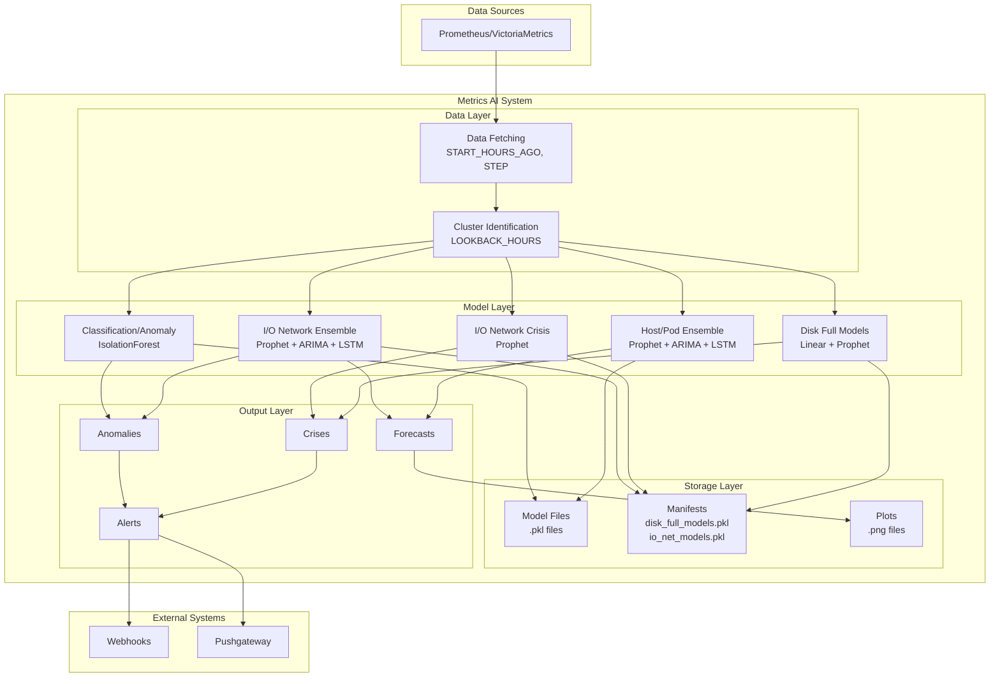

### Model Types Architecture

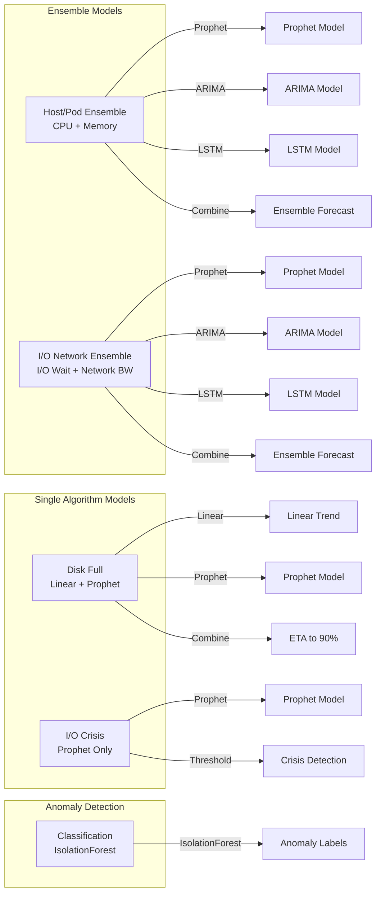

---

## Model Comparison Tables

### Model Types Overview

| Model Type | Purpose | Algorithms | Scope | Storage | Forecast Horizon |
|------------|---------|------------|-------|---------|------------------|
| **Host/Pod Ensemble** | CPU/Memory forecasting | Prophet + ARIMA + LSTM | Per-cluster or standalone | `k8s_cluster_{id}_forecast.pkl` | `HORIZON_MIN` (default: 15 min) |
| **Disk Full** | Disk usage prediction | Linear trend + Prophet | Per node/mountpoint | Manifest: `disk_full_models.pkl` | `horizon_days` (default: 7 days) |
| **I/O Network Crisis** | Crisis detection | Prophet | Per node/signal | Manifest: `io_net_models.pkl` | `horizon_days` (default: 7 days) |
| **I/O Network Ensemble** | Full I/O/Net forecasting | Prophet + ARIMA + LSTM | Per node/signal | Manifest: `io_net_models.pkl` | `HORIZON_MIN` (default: 15 min) |
| **Classification** | Anomaly detection | IsolationForest | Per-cluster | `isolation_forest_anomaly.pkl` | N/A (real-time) |

### Training vs Prediction Comparison

| Aspect | Training Mode (`--training`) | Forecast Mode (`--forecast`) | Normal Mode (default) |
|--------|----------------------------|------------------------------|----------------------|
| **Data Usage** | Full `START_HOURS_AGO` window | Full `START_HOURS_AGO` window | Full `START_HOURS_AGO` window |
| **Model Updates** | Full retraining | Minimal updates (recent data only) | No updates (use cached) |
| **Prophet Update** | Full training on all data | Last 7 days only | No update |
| **ARIMA Update** | Full training | Latest data refit | No update |
| **LSTM Update** | Full training (`LSTM_EPOCHS` epochs) | Fine-tune last 2 days (2 epochs) | No update |
| **Backtesting** | ✅ Yes (calculates MAE, RMSE) | ❌ No | ❌ No (unless `--show-backtest`) |
| **Plots Generated** | Forecast + Backtest | Forecast only | None (unless `--plot`) |
| **Execution Time** | ~5-15 minutes | ~10-30 seconds | ~5-10 seconds |
| **Use Case** | Initial setup, periodic retraining | Frequent monitoring | Quick status check |

### Algorithm Comparison

| Algorithm | Strengths | Weaknesses | Used In | Configuration Variables |
|-----------|-----------|------------|---------|------------------------|
| **Prophet** | Handles seasonality, trends, holidays | Slower training | All models | `HORIZON_MIN`, `horizon_days` |
| **ARIMA** | Fast, good for stationary data | Limited to linear patterns | Host/Pod, I/O Ensemble | `HORIZON_MIN` |
| **LSTM** | Captures complex patterns, non-linear | Requires more data, slower | Host/Pod, I/O Ensemble | `LSTM_SEQ_LEN`, `LSTM_EPOCHS`, `HORIZON_MIN` |
| **Linear Trend** | Very fast, simple | Only captures linear trends | Disk models | None (fixed) |
| **IsolationForest** | Unsupervised, no labels needed | Sensitive to contamination rate | Classification | `LOOKBACK_HOURS`, `CONTAMINATION` |

### Storage Comparison

| Model Type | Storage Method | File Pattern | Manifest | Update Frequency |
|------------|---------------|--------------|----------|------------------|
| **Host/Pod Ensemble** | Individual files | `k8s_cluster_{id}_forecast.pkl` | No | Per-cluster |
| **Disk Full** | Manifest-based | `disk_full_models.pkl` | Yes | Per disk (node+mountpoint) |
| **I/O Network Crisis** | Manifest-based | `io_net_models.pkl` | Yes | Per node+signal |
| **I/O Network Ensemble** | Manifest-based | `io_net_models.pkl` | Yes | Per node+signal |
| **Classification** | Individual files | `isolation_forest_anomaly.pkl` | No | Per-cluster |

---

## Training Flow Diagrams

### Complete Training Flow

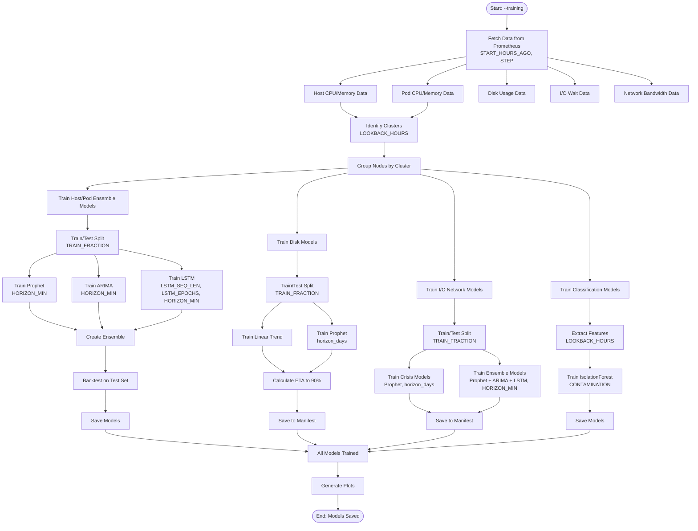

### Host/Pod Ensemble Training Detail

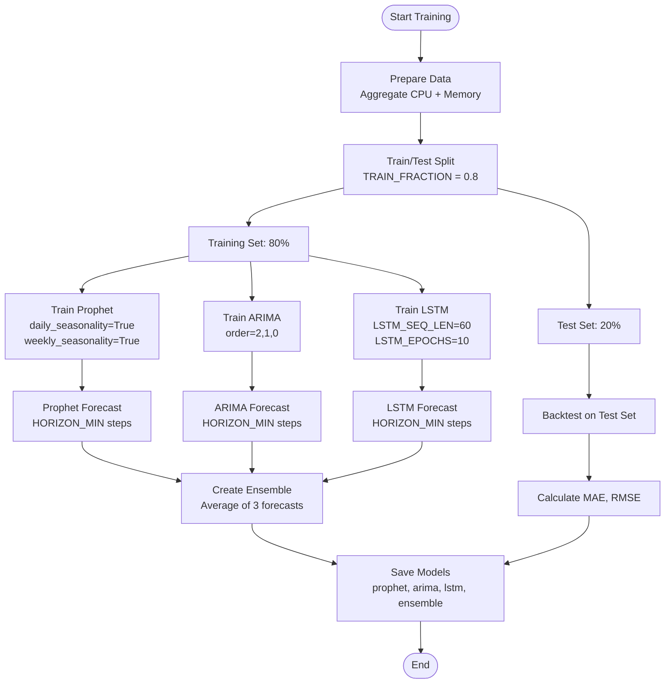

### Disk Model Training Detail

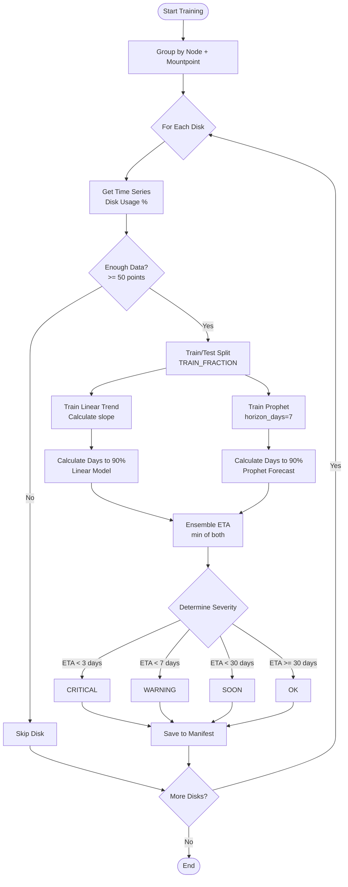

---

## Prediction Flow Diagrams

### Forecast Mode Flow

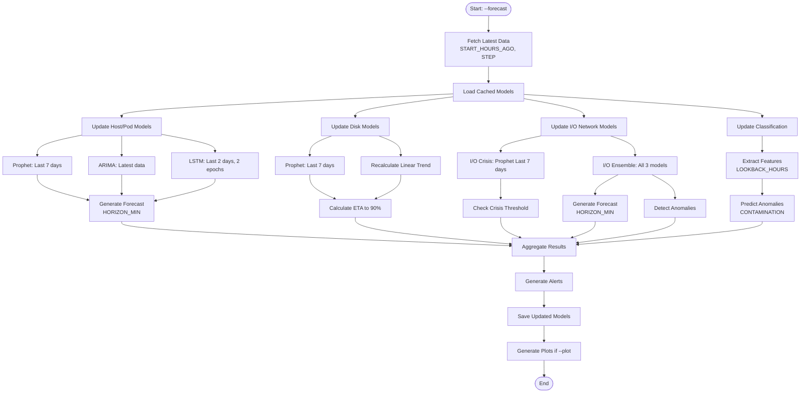

### Minimal Update Flow (Forecast Mode)

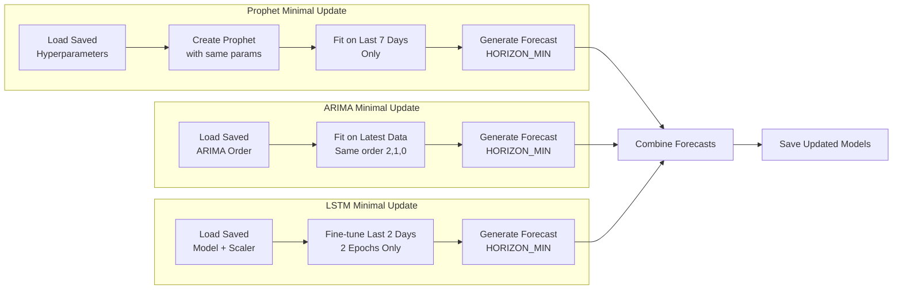

---

## Data Flow Diagrams

### Data Flow: Training to Prediction

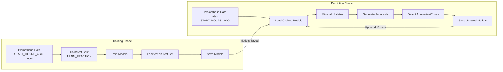

### Configuration Variables Flow

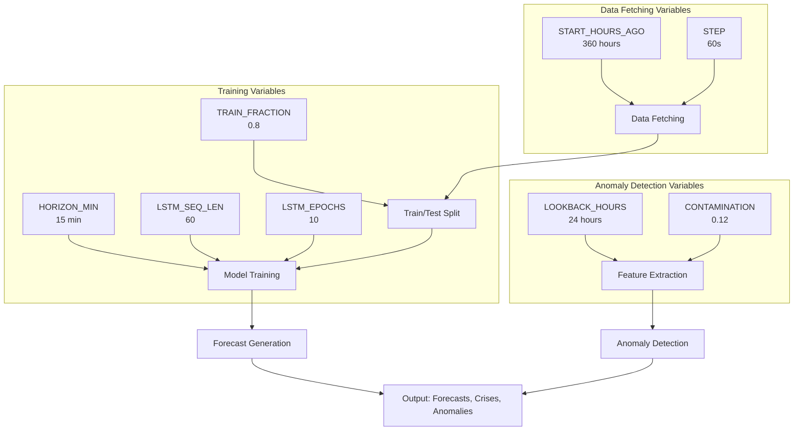

---

## Configuration Impact Matrix

### Detailed Configuration Impact

| Variable | Default | Host/Pod Ensemble | Disk Models | I/O Crisis | I/O Ensemble | Classification | Impact Description |
|----------|---------|-------------------|-------------|------------|--------------|----------------|-------------------|
| **START_HOURS_AGO** | 360 | ✅ High | ✅ High | ✅ High | ✅ High | ✅ High | More data = better training, but slower |
| **STEP** | "60s" | ✅ Medium | ✅ Medium | ✅ Medium | ✅ Medium | ✅ Medium | Smaller = more data points, better accuracy |
| **TRAIN_FRACTION** | 0.8 | ✅ High | ✅ High | ✅ High | ✅ High | ❌ N/A | Controls train/test split ratio |
| **HORIZON_MIN** | 15 | ✅ Critical | ❌ N/A | ❌ N/A | ✅ Critical | ❌ N/A | Forecast length in minutes |
| **LSTM_SEQ_LEN** | 60 | ✅ High | ❌ N/A | ❌ N/A | ✅ High | ❌ N/A | Input sequence length for LSTM |
| **LSTM_EPOCHS** | 10 | ✅ Medium | ❌ N/A | ❌ N/A | ✅ Medium | ❌ N/A | Training iterations for LSTM |
| **LOOKBACK_HOURS** | 24 | ❌ N/A | ❌ N/A | ❌ N/A | ❌ N/A | ✅ Critical | Feature extraction window |
| **CONTAMINATION** | 0.12 | ❌ N/A | ❌ N/A | ❌ N/A | ❌ N/A | ✅ Critical | Expected anomaly rate |

### Impact Legend
- ✅ **Critical**: Directly affects model behavior/accuracy
- ✅ **High**: Significant impact on results
- ✅ **Medium**: Moderate impact
- ❌ **N/A**: Not used by this model

### Variable Priority by Model

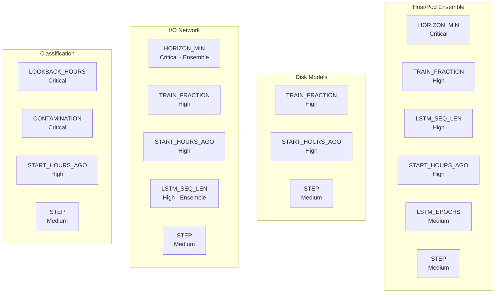

---

## Model Execution Order

### Normal Execution Flow

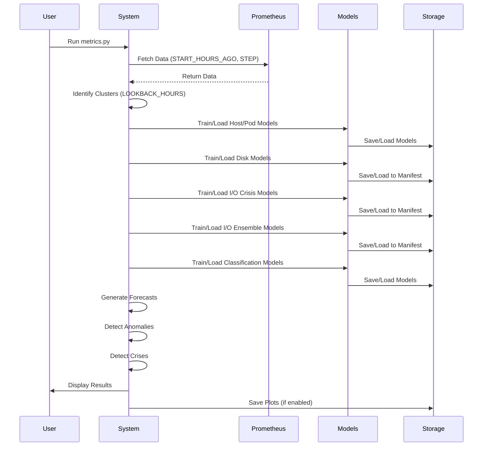

---

## Quick Reference: Model Selection Guide

### When to Use Each Model

| Use Case | Model Type | Why |
|----------|------------|-----|
| **CPU/Memory forecasting** | Host/Pod Ensemble | Combines 3 algorithms for robust predictions |
| **Disk capacity planning** | Disk Full | Predicts when disk will reach 90% |
| **I/O performance crisis** | I/O Network Crisis | Fast detection of I/O bottlenecks |
| **I/O/Network forecasting** | I/O Network Ensemble | Full ensemble for accurate predictions |
| **Anomaly detection** | Classification | Identifies unusual resource patterns |

### Performance Characteristics

| Model Type | Training Time | Prediction Time | Accuracy | Use Case |
|------------|--------------|-----------------|----------|----------|
| **Host/Pod Ensemble** | ~2-5 min | ~1-2 sec | High | Production forecasting |
| **Disk Full** | ~30 sec | ~0.5 sec | Medium-High | Capacity planning |
| **I/O Network Crisis** | ~20 sec | ~0.3 sec | Medium | Quick crisis detection |
| **I/O Network Ensemble** | ~1-3 min | ~1 sec | High | Detailed I/O analysis |
| **Classification** | ~10 sec | ~0.1 sec | Medium | Anomaly detection |

---

## See Also

- `MODEL_TRAINING_AND_PREDICTION_GUIDE.md` - Detailed step-by-step guide
- `CONFIGURATION_VARIABLES.md` - Variable explanations
- `../README.md` - General documentation
- `SYSTEM_DOCUMENTATION.md` - System architecture

