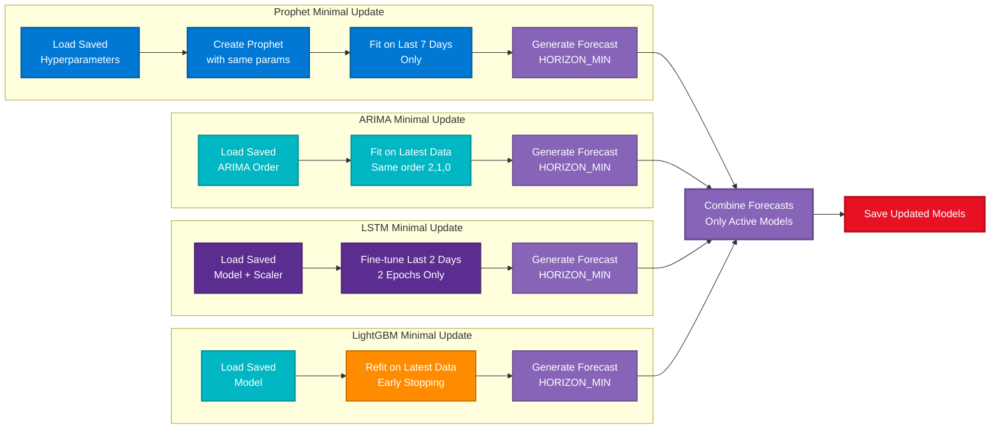

# Visual Architecture and Flow Guide

This document provides visual representations of the Metrics AI system architecture, model flows, and comparisons.

## Color Coding Legend

All diagrams use a consistent color scheme for easy identification:

| Color | Usage | Hex Code |
|-------|-------|----------|
| 🔵 **Light Blue** | Data Sources, Prophet Models, Start/End nodes | `#0078D4` |
| 🟢 **Light Green** | Data Fetching, Data Processing, OK status | `#107C10` |
| 🟡 **Light Orange** | Model Training, Updates, Warnings, Aggregation | `#FF8C00` |
| 🟣 **Light Purple** | Storage, Ensemble Models, Forecasts, Output | `#8764B8` |
| 🔴 **Light Red** | Critical alerts, Anomalies, Save operations | `#E81123` |
| 🟦 **Light Teal** | ARIMA Models, Data Processing, Load operations | `#00B7C3` |
| 🟪 **Light Indigo** | LSTM Models, External Systems, Save operations | `#5C2D91` |
| 🟩 **Light Green** | LightGBM Models, Gradient Boosting | `#28A745` |
| ⚫ **Light Gray** | Decision points, Process steps, Skipped models | `#6B6B6B` |

**Note**: Mermaid diagrams support color coding and styling. Some viewers (like GitHub, GitLab, VS Code with Mermaid extensions) will render these colors automatically. For enhanced interactivity and animations, consider using tools like [Mermaid Live Editor](https://mermaid.live/) or embedding in web pages with custom CSS animations.

---

## Table of Contents

1. [System Architecture Overview](#system-architecture-overview)
2. [Model Comparison Tables](#model-comparison-tables)
3. [Training Flow Diagrams](#training-flow-diagrams)
4. [Prediction Flow Diagrams](#prediction-flow-diagrams)
5. [Data Flow Diagrams](#data-flow-diagrams)
6. [Configuration Impact Matrix](#configuration-impact-matrix)

---

## System Architecture Overview

### High-Level Architecture


### Model Types Architecture


---

## Model Comparison Tables

### Model Types Overview

| Model Type | Purpose | Algorithms | Scope | Storage | Forecast Horizon |
|------------|---------|------------|-------|---------|------------------|
| **Host/Pod Ensemble** | CPU/Memory forecasting | Prophet + ARIMA + LSTM + LightGBM | Per-cluster or standalone | `k8s_cluster_{id}_forecast.pkl` | `HORIZON_MIN` (default: 15 min) |
| **Disk Full** | Disk usage prediction | Linear trend + Prophet (daily + weekly seasonality) | Per node/mountpoint | Manifest: `disk_full_models.pkl` | `horizon_days` (default: 7 days) |
| **I/O Network Crisis** | Crisis detection | Prophet (daily + weekly seasonality) | Per node/signal | Manifest: `io_net_models.pkl` | `horizon_days` (default: 7 days) |
| **I/O Network Ensemble** | Full I/O/Net forecasting | Prophet + ARIMA + LSTM + LightGBM (temporal-aware anomaly detection) | Per node/signal | Manifest: `io_net_models.pkl` | `HORIZON_MIN` (default: 15 min) |
| **Unified Correlated** | Multi-metric ensemble | Prophet + LSTM + LightGBM (ARIMA skipped) | Per node (all 6 metrics) | `unified_correlated_{node}_forecast.pkl` | `HORIZON_MIN` (default: 15 min) |
| **Classification** | Anomaly detection | IsolationForest (temporal-aware if 3+ months data) | Per-cluster | `isolation_forest_anomaly.pkl` | N/A (real-time) |

### Training vs Prediction Comparison

| Aspect | Training Mode (`--training`) | Forecast Mode (`--forecast`) | Normal Mode (default) |
|--------|----------------------------|------------------------------|----------------------|
| **Data Usage** | Full `START_HOURS_AGO` window | Full `START_HOURS_AGO` window | Full `START_HOURS_AGO` window |
| **Model Updates** | Full retraining | Minimal updates (recent data only) | No updates (use cached) |
| **Prophet Update** | Full training on all data | Last 7 days only | No update |
| **ARIMA Update** | Full training | Latest data refit | No update (skipped for unified correlated models) |
| **LSTM Update** | Full training (`LSTM_EPOCHS` epochs) | Fine-tune last 2 days (2 epochs) | No update |
| **LightGBM Update** | Full training (with early stopping) | Latest data refit (with early stopping) | No update |
| **Backtesting** | ✅ Yes (calculates MAE, RMSE) | ❌ No | ❌ No (unless `--show-backtest`) |
| **Plots Generated** | Forecast + Backtest | Forecast only | None (unless `--plot`) |
| **Execution Time** | ~5-15 minutes | ~10-30 seconds | ~5-10 seconds |
| **Use Case** | Initial setup, periodic retraining | Frequent monitoring | Quick status check |

### Algorithm Comparison

| Algorithm | Strengths | Weaknesses | Used In | Configuration Variables |
|-----------|-----------|------------|---------|------------------------|
| **Prophet** | Handles seasonality (daily + weekly), trends, holidays | Slower training | All models | `HORIZON_MIN`, `horizon_days` |
| **ARIMA** | Fast, good for stationary data | Limited to linear patterns, poor on normalized data | Host/Pod, I/O Ensemble (skipped for unified correlated) | `HORIZON_MIN` |
| **LSTM** | Captures complex patterns, non-linear | Requires more data, slower | Host/Pod, I/O Ensemble, Unified Correlated | `LSTM_SEQ_LEN`, `LSTM_EPOCHS`, `HORIZON_MIN` |
| **LightGBM** | High accuracy, fast training, early stopping | Requires minimum 4 features | Host/Pod, I/O Ensemble, Unified Correlated | `LIGHTGBM_ENABLED`, `HORIZON_MIN` |
| **Linear Trend** | Very fast, simple | Only captures linear trends | Disk models | None (fixed) |
| **IsolationForest** | Unsupervised, no labels needed, temporal-aware | Sensitive to contamination rate | Classification | `LOOKBACK_HOURS`, `CONTAMINATION` (temporal features if 3+ months data) |

### Storage Comparison

| Model Type | Storage Method | File Pattern | Manifest | Update Frequency |
|------------|---------------|--------------|----------|------------------|
| **Host/Pod Ensemble** | Individual files | `k8s_cluster_{id}_forecast.pkl` | No | Per-cluster |
| **Disk Full** | Manifest-based | `disk_full_models.pkl` | Yes | Per disk (node+mountpoint) |
| **I/O Network Crisis** | Manifest-based | `io_net_models.pkl` | Yes | Per node+signal |
| **I/O Network Ensemble** | Manifest-based | `io_net_models.pkl` | Yes | Per node+signal |
| **Unified Correlated** | Individual files | `unified_correlated_{node}_forecast.pkl` | No | Per node (all 6 metrics) |
| **Classification** | Individual files | `isolation_forest_anomaly.pkl` | No | Per-cluster |

---

## Training Flow Diagrams

### Complete Training Flow


### Host/Pod Ensemble Training Detail


### Disk Model Training Detail


---

## Prediction Flow Diagrams

### Forecast Mode Flow


### Minimal Update Flow (Forecast Mode)



---

## Data Flow Diagrams

### Data Flow: Training to Prediction


### Configuration Variables Flow

```mermaid
graph TD
    subgraph "Data Fetching Variables"
        START[START_HOURS_AGO<br/>360 hours] --> Fetch[Data Fetching]
        STEP[STEP<br/>60s] --> Fetch
    end
    
    subgraph "Training Variables"
        TRAIN[TRAIN_FRACTION<br/>0.8] --> Split[Train/Test Split]
        HORIZON[HORIZON_MIN<br/>15 min] --> Models[Model Training]
        LSTM_SEQ[LSTM_SEQ_LEN<br/>60] --> Models
        LSTM_EPOCH[LSTM_EPOCHS<br/>10] --> Models
        LIGHTGBM[LIGHTGBM_ENABLED<br/>True] --> Models
    end
    
    subgraph "Anomaly Detection Variables"
        LOOKBACK[LOOKBACK_HOURS<br/>24 hours] --> Anomaly[Feature Extraction<br/>Temporal-Aware if 3+ months]
        CONTAM[CONTAMINATION<br/>0.12] --> Anomaly
    end
    
    subgraph "CLI Overrides"
        CLI_HORIZON[--forecast-horizon<br/>realtime|neartime|future] --> Models
        CLI_PARALLEL[--parallel N] --> Models
    end
    
    Fetch --> Split
    Split --> Models
    Models --> Forecast[Forecast Generation]
    Anomaly --> AnomalyDet[Anomaly Detection]
    
    Forecast --> Output[Output: Forecasts, Crises, Anomalies]
    AnomalyDet --> Output
    
    classDef dataVar fill:#107C10,stroke:#0B5A0B,stroke-width:2px,color:#fff
    classDef trainVar fill:#FF8C00,stroke:#CC7000,stroke-width:2px,color:#fff
    classDef anomalyVar fill:#E81123,stroke:#BA0E1C,stroke-width:2px,color:#fff
    classDef process fill:#00B7C3,stroke:#00929A,stroke-width:3px,color:#fff
    classDef output fill:#8764B8,stroke:#6B4F93,stroke-width:3px,color:#fff
    
    class START,STEP,Fetch dataVar
    class TRAIN,HORIZON,LSTM_SEQ,LSTM_EPOCH,Split,Models trainVar
    class LOOKBACK,CONTAM,Anomaly anomalyVar
    class Forecast,AnomalyDet process
    class Output output
```

---

## Configuration Impact Matrix

### Detailed Configuration Impact

| Variable | Default | Host/Pod Ensemble | Disk Models | I/O Crisis | I/O Ensemble | Classification | Impact Description |
|----------|---------|-------------------|-------------|------------|--------------|----------------|-------------------|
| **START_HOURS_AGO** | 360 | ✅ High | ✅ High | ✅ High | ✅ High | ✅ High | More data = better training, but slower |
| **STEP** | "60s" | ✅ Medium | ✅ Medium | ✅ Medium | ✅ Medium | ✅ Medium | Smaller = more data points, better accuracy |
| **TRAIN_FRACTION** | 0.8 | ✅ High | ✅ High | ✅ High | ✅ High | ❌ N/A | Controls train/test split ratio |
| **HORIZON_MIN** | 15 | ✅ Critical | ❌ N/A | ❌ N/A | ✅ Critical | ❌ N/A | Forecast length in minutes (can be overridden with `--forecast-horizon`) |
| **LSTM_SEQ_LEN** | 60 | ✅ High | ❌ N/A | ❌ N/A | ✅ High | ❌ N/A | Input sequence length for LSTM |
| **LSTM_EPOCHS** | 10 | ✅ Medium | ❌ N/A | ❌ N/A | ✅ Medium | ❌ N/A | Training iterations for LSTM |
| **LIGHTGBM_ENABLED** | True | ✅ High | ❌ N/A | ❌ N/A | ✅ High | ❌ N/A | Enable/disable LightGBM (enabled by default) |
| **LOOKBACK_HOURS** | 24 | ❌ N/A | ❌ N/A | ❌ N/A | ❌ N/A | ✅ Critical | Feature extraction window (temporal-aware if 3+ months data) |
| **CONTAMINATION** | 0.12 | ❌ N/A | ❌ N/A | ❌ N/A | ❌ N/A | ✅ Critical | Expected anomaly rate |
| **--forecast-horizon** | N/A | ✅ Override | ❌ N/A | ❌ N/A | ✅ Override | ❌ N/A | CLI flag: realtime=15min, neartime=3h, future=7d |
| **--parallel** | N/A | ✅ Override | ✅ Override | ✅ Override | ✅ Override | ❌ N/A | CLI flag: Override CPU detection, bypasses thresholds |

### Impact Legend
- ✅ **Critical**: Directly affects model behavior/accuracy
- ✅ **High**: Significant impact on results
- ✅ **Medium**: Moderate impact
- ❌ **N/A**: Not used by this model

### Variable Priority by Model


---

## Model Execution Order

### Normal Execution Flow (Training Mode)


---

## Quick Reference: Model Selection Guide

### When to Use Each Model

| Use Case | Model Type | Why |
|----------|------------|-----|
| **CPU/Memory forecasting** | Host/Pod Ensemble | Combines 4 algorithms (Prophet, ARIMA, LSTM, LightGBM) for robust predictions |
| **Disk capacity planning** | Disk Full | Predicts when disk will reach 90% |
| **I/O performance crisis** | I/O Network Crisis | Fast detection of I/O bottlenecks |
| **I/O/Network forecasting** | I/O Network Ensemble | Full ensemble for accurate predictions |
| **Multi-metric system health** | Unified Correlated | Single model using all 6 metrics with cross-correlations |
| **Anomaly detection** | Classification | Identifies unusual resource patterns |

### Performance Characteristics

| Model Type | Training Time | Prediction Time | Accuracy | Use Case |
|------------|--------------|-----------------|----------|----------|
| **Host/Pod Ensemble** | ~2-5 min | ~1-2 sec | High | Production forecasting |
| **Disk Full** | ~30 sec | ~0.5 sec | Medium-High | Capacity planning |
| **I/O Network Crisis** | ~20 sec | ~0.3 sec | Medium | Quick crisis detection |
| **I/O Network Ensemble** | ~1-3 min | ~1 sec | High | Detailed I/O analysis |
| **Unified Correlated** | ~2-4 min | ~1-2 sec | High | Multi-metric system health |
| **Classification** | ~10 sec | ~0.1 sec | Medium | Anomaly detection |

---

## See Also

- `MODEL_TRAINING_AND_PREDICTION_GUIDE.md` - Detailed step-by-step guide
- `CONFIGURATION_VARIABLES.md` - Variable explanations
- `../README.md` - General documentation
- `SYSTEM_DOCUMENTATION.md` - System architecture

