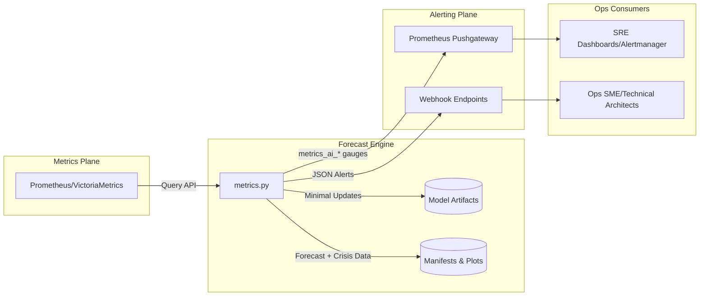

# Metrics AI - Infrastructure Resource Forecasting & Anomaly Detection

A comprehensive ML-powered forecasting and anomaly detection system for Kubernetes infrastructure, providing real-time predictions for CPU, Memory, Disk, I/O, and Network metrics using ensemble models (Prophet, ARIMA, LSTM).

## Features

- **Dual-Layer Forecasting**: Separate models for Host (full node) and Pod (Kubernetes workloads) layers
- **Kubernetes Cluster Awareness**: Automatic cluster identification and per-cluster model training
- **Standalone Node Support**: Separate handling for nodes without Kubernetes workloads
- **Ensemble Models**: Combines Prophet, ARIMA, and LSTM for robust predictions
- **Multiple Metric Types**: CPU, Memory, Disk Usage, Disk I/O, Network bandwidth
- **Anomaly Detection**: Isolation Forest-based classification for detecting anomalous nodes
- **Minimal Updates**: Efficient forecast mode with incremental model updates
- **Selective Retraining**: Retrain specific nodes/mounts/signals without full retraining
- **Comprehensive Plotting**: Automatic generation of forecast and backtest plots
- **Integrated Alerting**: Webhook payloads plus Prometheus Pushgateway metrics for SRE workflows
- **Parallel Processing**: Automatic CPU detection with 80% resource utilization rule, respects Kubernetes/Docker container limits

## Architecture Overview



- **Metrics Plane** – Prometheus or VictoriaMetrics hosts raw time-series data queried during each run.
- **Forecast Engine** – `metrics.py` performs ensemble forecasts, anomaly detection, and manifests/plot management using cached artifacts.
- **Alerting Plane** – Webhook payloads provide rich JSON for chat/incident tools, while Pushgateway metrics feed Prometheus/Alertmanager.
- **Ops Consumers** – SREs, architects, and SMEs consume plots, manifests, and alerts to drive operational decisions.

## Installation

### Prerequisites

- Python 3.8+
- Access to Prometheus/VictoriaMetrics endpoint
- Required Python packages (see `requirements.txt`)

### Setup

```bash
# Clone the repository
git clone <repository-url>
cd metrics-ai

# Create virtual environment (recommended)
python3 -m venv venv
source venv/bin/activate  # On Windows: venv\Scripts\activate

# Install dependencies
pip install -r requirements.txt

# Optional: Install TensorFlow for LSTM support
pip install tensorflow-cpu
```

## Configuration

### Environment Variables

The system is highly configurable via environment variables:

#### Data Source
- `VM_URL`: Prometheus/VictoriaMetrics query endpoint (default: `http://vm.london.local/api/v1/query_range`)
- `STEP`: Query step size (default: `60s`)
- `START_HOURS_AGO`: Historical data range in hours (default: `360`)

#### Model Configuration
- `HORIZON_MIN`: Forecast horizon in minutes (default: `15`)
- `LOOKBACK_HRS`: Lookback window for anomaly detection (default: `24`)
- `CONTAMINATION`: Anomaly detection contamination rate (default: `0.12`)
- `TRAIN_FRACTION`: Train/test split ratio (default: `0.8`)
- `PLOT_HISTORY_HOURS`: Hours of historical data to include in plots (default: `168` → 7 days)
- `PLOT_FORECAST_HOURS`: Hours of forecast horizon to draw in plots (default: `168` → 7 days)


#### LSTM Configuration
- `LSTM_SEQ_LEN`: LSTM sequence length (default: `60`)
- `LSTM_EPOCHS`: LSTM training epochs (default: `10`)

#### File Paths
- `MODEL_FILES_DIR`: Directory for model files (default: `./model_files`)
- `FORECAST_PLOTS_DIR`: Directory for forecast plots (default: `./forecast_plots`)

#### Advanced
- `DNS_DOMAIN_SUFFIXES`: Comma-separated DNS suffixes for hostname resolution (default: `.london.local,.local`)
- `INSTANCE_ALIAS_MAP`: JSON map for instance aliases (default: `{}`)
- `AUTO_ALIAS_ENABLED`: Enable automatic alias detection (default: `1`)
- `VERBOSE_LEVEL`: Logging verbosity (default: `0`)
- `MAX_WORKER_THREADS`: Maximum number of parallel workers (default: auto-detected as 80% of available CPUs)
  - Automatically detects physical CPU count via `os.cpu_count()`
  - Respects Kubernetes/Docker container CPU limits via cgroups
  - Applies 80% utilization rule (leaves 20% headroom)
  - Can be overridden via environment variable (e.g., `export MAX_WORKER_THREADS=4`) or CLI flag `--parallel N`

### Example Configuration

```bash
export VM_URL="http://prometheus.example.com/api/v1/query_range"
export MODEL_FILES_DIR="/var/lib/metrics-ai/models"
export FORECAST_PLOTS_DIR="/var/lib/metrics-ai/plots"
export HORIZON_MIN=30
export START_HOURS_AGO=720
```

## Usage

### Basic Commands

#### 1. Initial Training (First Run)

Train all models from scratch:

```bash
python3 metrics.py --training
```

**Output:**
- Trains Host, Pod, Disk, I/O, and Network models
- Generates backtest plots and metrics
- Saves all models to `MODEL_FILES_DIR`
- Creates forecast plots in `FORECAST_PLOTS_DIR`

#### 2. Forecast Mode (Recommended for Frequent Runs)

Generate forecasts using cached models with minimal updates:

```bash
# Single run (no loop)
python3 metrics.py --forecast --interval 0

# Continuous monitoring (runs every 15 seconds)
python3 metrics.py --forecast

# Custom interval (runs every 30 seconds)
python3 metrics.py --forecast --interval 30

# With custom plot windows
python3 metrics.py --forecast --plot-history-hours 48 --plot-forecast-hours 12

# With alerting
python3 metrics.py --forecast \
  --alert-webhook https://hooks.slack.com/services/... \
  --pushgateway http://pushgateway.monitoring:9091

# Continuous monitoring with alerts (recommended for production)
python3 metrics.py --forecast \
  --interval 15 \
  --alert-webhook https://hooks.slack.com/services/... \
  --pushgateway http://pushgateway.monitoring:9091

# Skip plot generation for faster execution
python3 metrics.py --forecast --interval 15

# Generate plots (slower but includes visualizations)
python3 metrics.py --forecast --interval 15 --plot
```

**Command-Line Options:**
- `--forecast`: Enable forecast mode (uses cached models, minimal updates)
- `--interval <seconds>`: Run continuously with specified interval (default: 15). Set to `0` for single run.
- `--alert-webhook <URL>`: HTTP webhook URL for alert delivery (Slack, Teams, PagerDuty, etc.)
- `--pushgateway <URL>`: Prometheus Pushgateway URL for metrics export
- `--plot`: Generate and save plot files (PNG images). If not specified, plots are skipped to save time.
- `--plot-history-hours <hours>`: Override plot history window (default: 168 = 7 days)
- `--plot-forecast-hours <hours>`: Override plot forecast window (default: 168 = 7 days)
- `--parallel <N>`: Override automatic CPU detection and use N parallel workers (overrides 80% rule, `MAX_WORKER_THREADS` env var, and bypasses >10 items threshold). Example: `--parallel 4`
- `-v, --verbose`: Increase verbosity (repeatable: `-vv`, `-vvv`)
- `-q, --quiet`: Suppress verbose output
- `--dump-csv <dir>`: Dump training datasets for each model into the specified directory (created if missing)

**Output:**
- Updates models with latest data (minimal updates)
- Generates forecast plots for all metrics (only when `--plot` flag is provided)
- Displays predictions and anomalies in tabular format
- Saves updated models to disk
- Dispatches alerts via webhook/Pushgateway when actionable issues detected
- **No backtest plots or metrics** (optimized for speed)
- Runs continuously every `--interval` seconds when `--interval > 0`

**Note:** Plot generation can be time-consuming. Use `--plot` only when you need visualizations. For production monitoring focused on alerts, omit `--plot` for faster execution.

**Use Case:** 
- **Single run**: Use `--interval 0` for one-time forecasts or testing
- **Continuous monitoring**: Use `--interval 15` (or higher) for production monitoring with real-time alerts
- **Kubernetes Deployment**: Deploy as a `Deployment` (not CronJob) with `--interval 15` for continuous monitoring

#### 3. View Backtest Metrics (Without Retraining)

View backtest performance of cached models:

```bash
python3 metrics.py --show-backtest
```

**Output:**
- Displays backtest metrics (MAE, train/test split) for all models
- Generates backtest plots
- Does not retrain models (uses cached)

#### 4. Normal Mode (Pre-trained Models)

Use pre-trained models without updates:

```bash
python3 metrics.py
```

**Output:**
- Uses cached models as-is
- No plots generated
- No backtest metrics shown
- Fast execution

### Selective Retraining

#### Retrain Disk Models

Retrain specific disk models:

```bash
# Retrain all disk models
python3 metrics.py --disk-retrain all

# Retrain specific node
python3 metrics.py --disk-retrain host02

# Retrain specific node:mountpoint combination
python3 metrics.py --disk-retrain host02:/,worker01:/home

# Retrain multiple targets
python3 metrics.py --disk-retrain host02,worker01:/home,worker03:/
```

**Output:**
- Retrains only specified disk models
- Generates backtest plots and metrics for retrained models
- Updates manifest with new predictions

#### Retrain I/O and Network Models

Retrain specific I/O and Network models:

```bash
# Retrain all I/O and Network models
python3 metrics.py --io-net-retrain all

# Retrain all signals for a specific node
python3 metrics.py --io-net-retrain host02

# Retrain specific signal for a node
python3 metrics.py --io-net-retrain host02:DISK_IO_WAIT

# Retrain multiple targets
python3 metrics.py --io-net-retrain host02:DISK_IO_WAIT,worker01:NET_TX_BW
```

**Output:**
- Retrains only specified I/O and Network models
- Generates backtest plots and metrics for retrained models
- Updates manifest with new models

### Combined Options

```bash
# Training with backtest metrics
python3 metrics.py --training --show-backtest

# Forecast mode with verbose output
python3 metrics.py --forecast -v
# Forecast with custom plot windows
python3 metrics.py --forecast --plot-history-hours 72 --plot-forecast-hours 6

# Retrain specific models and show backtest
python3 metrics.py --disk-retrain host02 --io-net-retrain worker01 --show-backtest
```

### Alert Delivery

The system supports two alert delivery mechanisms for real-time notification of detected issues:

#### Webhook Alerts (`--alert-webhook`)

POSTs a JSON payload to HTTP webhooks (Slack, Teams, PagerDuty, custom endpoints) whenever actionable alerts are detected.

**Usage:**
```bash
python3 metrics.py --forecast --alert-webhook https://hooks.slack.com/services/YOUR/WEBHOOK/URL
```

**Webhook Payload Structure:**
```json
{
  "timestamp": "2025-11-21T11:32:56.529548",
  "summary_text": "Disk → 0 critical, 0 warning, 1 soon | I/O+Network Crisis → 0 | I/O+Network Anomaly → 0 | Golden Signals → 0 | Classification Anomalies → 1 | Host Pressure → 1",
  "disk": {
    "critical": 0,
    "warning": 0,
    "soon": 1,
    "total": 1,
    "samples": [
      {
        "instance": "host02 (192.168.10.82)",
        "mountpoint": "/",
        "current_%": 79.67,
        "days_to_90pct": 31.8,
        "ensemble_eta": 31.8,
        "linear_eta": 9999.0,
        "prophet_eta": 31.8,
        "alert": "SOON"
      }
    ]
  },
  "io_network_crisis": {
    "total": 0,
    "samples": []
  },
  "io_network_anomaly": {
    "total": 0,
    "samples": []
  },
  "golden_anomaly": {
    "total": 0,
    "samples": []
  },
  "classification_anomaly": {
    "total": 1,
    "samples": [
      {
        "instance": "host02 (192.168.10.82)",
        "host_cpu": 0.313898,
        "host_mem": 0.454784,
        "pod_cpu": 0.843041,
        "pod_mem": 0.974526,
        "severity": "WARNING",
        "signal": "anomalous_node",
        "detected_at": "2025-11-21 11:32:56"
      }
    ]
  },
  "host_pressure": {
    "total": 1,
    "samples": [
      {
        "instance": "pi (192.168.10.200)",
        "host_cpu": 0.174918,
        "host_mem": 0.840407,
        "severity": "WARNING",
        "signal": "host_pressure",
        "detected_at": "2025-11-21 11:32:56"
      }
    ]
  }
}
```

**Alert Categories:**
- **Disk Alerts**: CRITICAL (<3 days to 90%), WARNING (3-7 days), SOON (7-30 days). Only non-OK alerts are included.
- **I/O+Network Crisis**: Predicted I/O or network saturation within 30 days
- **I/O+Network Anomaly**: Anomalous I/O or network patterns detected
- **Golden Anomaly**: Root-cause signals (iowait, inodes, network drops, OOM kills, etc.)
- **Classification Anomaly**: Nodes with anomalous host/pod usage patterns (high host usage but low pod usage, or vice versa)
- **Host Pressure**: Nodes with high host CPU/memory usage but minimal Kubernetes workload (suggests OS-level processes)

**Note:** Webhooks are only sent when there are actionable alerts (non-OK status). If all systems are healthy, no webhook is dispatched.

#### Prometheus Pushgateway (`--pushgateway`)

Publishes metrics to Prometheus Pushgateway for integration with Alertmanager and Grafana dashboards.

**Usage:**
```bash
python3 metrics.py --forecast --pushgateway http://pushgateway.monitoring:9091
```

**Published Metrics:**
- `metrics_ai_disk_alerts_critical` - Count of critical disk alerts
- `metrics_ai_disk_alerts_warning` - Count of warning disk alerts
- `metrics_ai_disk_alerts_soon` - Count of soon disk alerts
- `metrics_ai_disk_alerts_total` - Total non-OK disk alerts
- `metrics_ai_io_network_crisis_total` - I/O+Network crisis count
- `metrics_ai_io_network_anomaly_total` - I/O+Network anomaly count
- `metrics_ai_golden_anomaly_total` - Golden anomaly signal count
- `metrics_ai_classification_anomaly_total` - Classification anomaly count
- `metrics_ai_host_pressure_total` - Host pressure alert count

**Continuous Monitoring:**
Both alert mechanisms honor the `--interval` flag (default 15 seconds). When running with `--interval > 0`, the system runs continuously and dispatches alerts on each cycle when actionable issues are detected. Set `--interval 0` for a single run.

**Example - Continuous Monitoring with Alerts:**
```bash
python3 metrics.py --forecast \
  --interval 15 \
  --alert-webhook https://hooks.slack.com/services/YOUR/WEBHOOK/URL \
  --pushgateway http://pushgateway.monitoring:9091
```

## Operations Runbook

### 1. Deployment Patterns
- **Single-shot validation**: `python3 metrics.py --forecast --interval 0` (CI/CD smoke test).
- **Continuous monitoring**: Kubernetes `Deployment` with `--forecast --interval 15` plus alert sinks.
- **Scheduled retraining**: CronJob or CI pipeline invoking `--training --show-backtest`.

### 2. Health Checks
- Verify manifests and plots are refreshed (`MODEL_FILES_DIR`, `FORECAST_PLOTS_DIR`).
- Confirm Pushgateway metrics (`metrics_ai_*`) are scraped (Prometheus `up` and `metrics_ai_*` queries).
- Webhook payloads should include `summary_text` and samples when alerts trigger.

### 3. Incident Response
1. **Review console tables** (disk forecast, classification anomalies, host pressure).
2. **Inspect plots** in `FORECAST_PLOTS_DIR` for impacted nodes.
3. **Check manifests** to confirm minimal updates saved (`disk_full_models.pkl`, `io_net_models.pkl`).
4. **Create/acknowledge incident** using webhook payload context.

### 4. Retraining / Targeted Fixes
- Disk: `--disk-retrain host02,/home`
- I/O+Network: `--io-net-retrain host02:DISK_IO_WAIT`
- Combine with `--show-backtest` to verify MAE improvements.
- Use `--dump-csv ./exports` to capture the exact training datasets for audits or offline experimentation.

### 5. Troubleshooting
- **Missing alerts**: run with `-v` to inspect “DEBUG: disk_alerts…” output; confirm thresholds still relevant.
- **Data gaps**: verify Prometheus query responses (HTTP 200, non-empty JSON).
- **Model drift**: trigger full training (`--training`) and compare MAE/RMSE.
- **Webhook/Pushgateway errors**: check HTTP status codes logged after “Alert webhook sent” / “Metrics pushed”.

### 6. Change Management
- Document CLI flags and env overrides in change tickets.
- Attach latest plots/manifests when promoting new models.
- Ensure rollback plan (previous manifests/models) is stored with release artifacts.

## Output Files

### Model Files (`MODEL_FILES_DIR`)

#### Kubernetes Cluster Models
- `k8s_cluster_{cluster_id}_forecast.pkl` - Per-cluster ensemble model (host + pod combined)
- `k8s_cluster_{cluster_id}_arima.pkl` - Per-cluster ARIMA model parameters
- `k8s_cluster_{cluster_id}_prophet_params.pkl` - Per-cluster Prophet hyperparameters
- `k8s_cluster_{cluster_id}_forecast.pkl.meta.json` - Cluster model metadata

#### Standalone Node Models
- `standalone_forecast.pkl` - Standalone nodes ensemble model
- `standalone_arima.pkl` - Standalone ARIMA model parameters
- `standalone_prophet_params.pkl` - Standalone Prophet hyperparameters

#### Legacy Models (Backward Compatibility)
- `host_forecast.pkl` - Legacy host layer ensemble model
- `pod_forecast.pkl` - Legacy pod layer ensemble model
- `host_arima.pkl` - Legacy host ARIMA model parameters
- `host_prophet_params.pkl` - Legacy host Prophet hyperparameters
- `pod_arima.pkl` - Legacy pod ARIMA model parameters
- `pod_prophet_params.pkl` - Legacy pod Prophet hyperparameters

#### Shared Models
- `lstm_model.pkl` - LSTM model (if TensorFlow available, shared across clusters)
- `disk_full_models.pkl` - Disk models manifest
- `io_net_models.pkl` - I/O and Network models manifest
- `isolation_forest_anomaly.pkl` - Anomaly detection model (per-cluster)
- `*.meta.json` - Model metadata files

### Forecast Plots (`FORECAST_PLOTS_DIR`)

#### Host/Pod Layer (Cluster-Aware)
- `k8s_layer_forecast.png` - Kubernetes cluster forecast (aggregated across all clusters, default 7d historical + 7d forecast, configurable)
- `k8s_layer_backtest.png` - Kubernetes cluster backtest (generated during training/--show-backtest)
- `standalone_layer_forecast.png` - Standalone nodes forecast (default 7d historical + 7d forecast, configurable)
- `standalone_layer_backtest.png` - Standalone nodes backtest (generated during training/--show-backtest)
- Legacy: `host_layer_forecast.png`, `pod_layer_forecast.png`, `host_layer_backtest.png`, `pod_layer_backtest.png` (for backward compatibility)

#### Disk Models
- `disk_{node}_{mountpoint}_forecast.png` - Individual disk forecast plots

#### I/O and Network
- `{node}_{signal}_forecast.png` - Crisis plots (historical + forecast windows follow global setting)
- `{signal}_{node}_layer_forecast.png` - Ensemble forecast plots (e.g., `DISK_IO_WAIT_host02_layer_forecast.png`)

#### Classification
- `classification_host_vs_pod.png` - Anomaly classification scatter plot

#### Reports
- `disk_full_prediction.csv` - Disk full prediction report

## Examples

### Example 1: Initial Setup and Training

```bash
# Set configuration
export VM_URL="http://prometheus.example.com/api/v1/query_range"
export MODEL_FILES_DIR="/opt/metrics-ai/models"
export FORECAST_PLOTS_DIR="/opt/metrics-ai/plots"

# Initial training
python3 metrics.py --training

# Expected output:
# - All models trained
# - Backtest metrics displayed
# - All plots generated
# - Models saved to /opt/metrics-ai/models
```

### Example 2: Scheduled Forecast Runs

```bash
# Add to crontab for every 15 seconds (using external scheduler)
# Or use systemd timer, Kubernetes CronJob, etc.

# Forecast mode (lightweight, fast)
python3 metrics.py --forecast

# Expected output:
# - Models updated with latest data
# - Forecast plots generated
# - Predictions displayed
# - Models saved with latest timestamp
```

### Example 3: Monitoring Specific Disks

```bash
# Retrain and monitor specific disk
python3 metrics.py --disk-retrain host02:/ --show-backtest

# Expected output:
# - Only host02:/ disk model retrained
# - Backtest metrics for that disk
# - Updated forecast plot
```

### Example 4: Debugging I/O Issues

```bash
# Retrain I/O models for specific node
python3 metrics.py --io-net-retrain host02:DISK_IO_WAIT --show-backtest

# Expected output:
# - Only DISK_IO_WAIT model for host02 retrained
# - Backtest metrics displayed
# - Updated forecast plot
```

### Example 5: Full System Health Check

```bash
# View all backtest metrics without retraining
python3 metrics.py --show-backtest

# Expected output:
# - All backtest metrics for all models
# - All backtest plots generated
# - No model retraining
```

## Model Architecture

### Ensemble Forecasting

Each forecasting model uses a 3-model ensemble:

1. **Prophet**: Handles seasonality and trends
2. **ARIMA**: Captures autoregressive patterns
3. **LSTM**: Deep learning for complex patterns (optional, requires TensorFlow)

Final prediction: Weighted ensemble of all three models

### Minimal Updates (Forecast Mode)

In `--forecast` mode, models receive minimal updates (required, not optional):
- **Prophet**: Loads saved hyperparameters, fits on last 7 days of data with optimized settings (`n_changepoints=10` for 30-40% faster fitting), saves updated hyperparameters
- **ARIMA**: Uses saved model order, fits on latest data, saves updated model
- **LSTM**: Loads pre-trained model, fine-tunes for 2 epochs on last 2 days, saves updated model

This preserves learned patterns while incorporating recent trends. All model files (including `host_arima.pkl`, `pod_arima.pkl`, `host_prophet_params.pkl`, `pod_prophet_params.pkl`) are updated with the latest timestamp after minimal updates.

**Performance**: Minimal updates are optimized for speed, especially beneficial when processing 100+ nodes. I/O and Network models include additional optimizations: pre-computed retrain matching, progress reporting, and conditional plot generation.

### Plot Window Overrides

- Defaults: 7 days of history + 7 days of forecast on every chart (host/pod, disk, I/O, network).
- Override globally with env vars (`PLOT_HISTORY_HOURS`, `PLOT_FORECAST_HOURS`).
- Override per run via CLI flags (`--plot-history-hours`, `--plot-forecast-hours`).
- All plot titles/legends automatically reflect the configured durations (e.g., “48 hours Historical + 12 hours Forecast”).

## Troubleshooting

### Models Not Found

If you see warnings about missing models:

```bash
# Train models first
python3 metrics.py --training
```

### LSTM Not Available

LSTM is optional. Install TensorFlow:

```bash
pip install tensorflow-cpu
```

The system will work without LSTM, using only Prophet and ARIMA.

### No Data from Prometheus

Check your `VM_URL` configuration:

```bash
# Test connection
curl "$VM_URL?query=up&start=$(date -d '1 hour ago' +%s)&end=$(date +%s)&step=60s"
```

### Plot Generation Issues

Ensure write permissions for `FORECAST_PLOTS_DIR`:

```bash
mkdir -p forecast_plots
chmod 755 forecast_plots
```

## Performance

- **Training Mode**: ~5-15 minutes (depends on data volume)
- **Forecast Mode**: ~10-30 seconds for typical deployments (optimized for frequent runs)
  - **I/O and Network**: ~200-400 seconds for 100 nodes (optimized with faster Prophet settings, progress reporting, and conditional plot generation)
- **Normal Mode**: ~5-10 seconds (uses cached models)

### Parallel Processing

The system automatically parallelizes model training and forecasting across multiple CPU cores:

- **Automatic CPU Detection**: Detects available CPU cores and applies 80% utilization rule
- **Container-Aware**: Respects Kubernetes/Docker CPU limits via cgroups detection
- **Override Options**: 
  - **Environment Variable**: `export MAX_WORKER_THREADS=4` (applies 80% rule to this value, respects thresholds)
  - **CLI Flag**: `--parallel 4` (direct override, highest priority, bypasses 80% rule AND thresholds)
- **Parallelization Thresholds** (only apply when using automatic detection, not with `--parallel`):
  - **Disk Models**: Parallelizes when processing >10 disks
  - **I/O Network Crisis**: Parallelizes when processing >10 nodes
  - **I/O Network Ensemble**: Parallelizes when processing >10 nodes
  - **Note**: When `--parallel` is set, these thresholds are bypassed and parallel processing is used regardless of item count
- **Worker Count**: Uses `min(total_items, MAX_WORKER_THREADS)` to avoid over-subscription
- **Performance Gains**: 
  - **Sequential**: 1 core utilization
  - **Parallel**: Up to 80% of available cores (e.g., 8 cores on 10-core system = 8 workers)
  - **Expected Speedup**: 3-6x for large deployments (100+ nodes/disks) depending on CPU count

**Example**: On a 10-core system with 100 disks:
- Sequential: ~400 seconds (1 core)
- Parallel (8 workers): ~50-80 seconds (8 cores, accounting for overhead)

**Override Examples**:
```bash
# Use 4 workers regardless of CPU count (bypasses 80% rule AND thresholds)
# Will parallelize even with <10 items
python3 metrics.py --forecast --parallel 4

# Use 16 workers (useful for high-core systems where you want full utilization)
python3 metrics.py --training --parallel 16

# Force parallel processing on small deployments (6 nodes, 9 disks)
python3 metrics.py --parallel 2  # Uses 2 workers even with <10 items
```

## License

See [LICENSE](LICENSE) for details.

## Contributing

Contributions are welcome! Please open an issue or submit a pull request.

## Support

For questions or issues, please open an issue in this repository.


